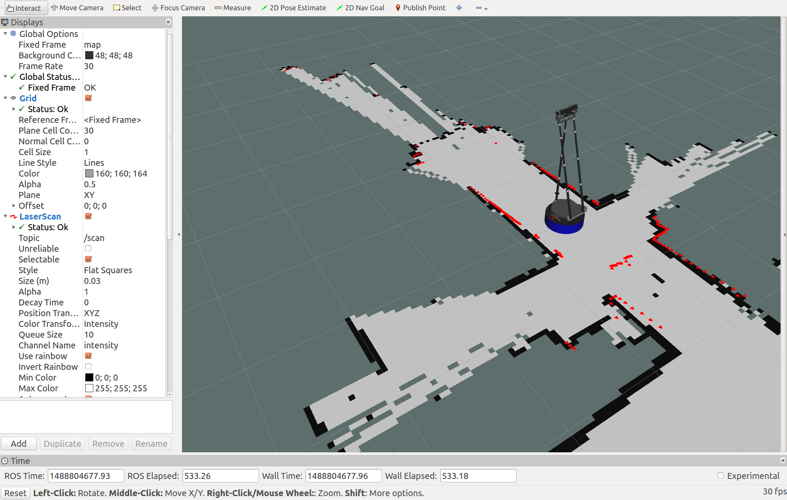
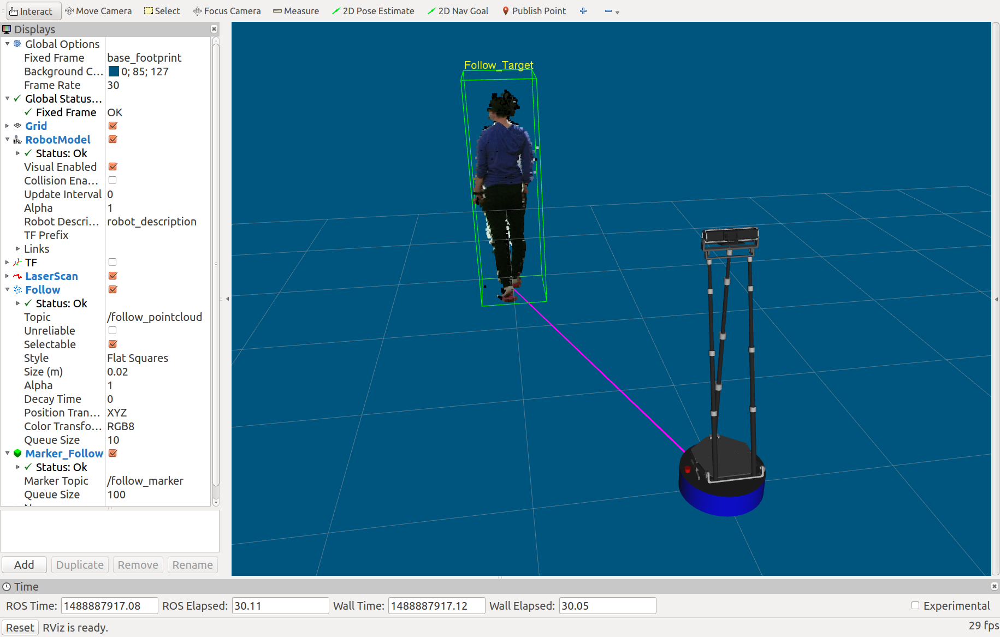

# 启智ROS机器人开放源码

## 使用步骤

1. 安装ROS.  
Kinetic/Ubuntu 16.04 [安装步骤](http://wiki.ros.org/kinetic/Installation/Ubuntu)
2. 配置好开发环境. [配置方法](http://wiki.ros.org/ROS/Tutorials/InstallingandConfiguringROSEnvironment)
3. 安装依赖项:  
Kinetic/Ubuntu 16.04
```
cd ~/catkin_ws/src/wpb_home/wpb_home_bringup/scripts
./install_for_kinetic.sh
```
ROS Melodic/Ubuntu 18.04
```
cd ~/catkin_ws/src/wpb_home/wpb_home_bringup/scripts
./install_for_melodic.sh
```
4. 获取源码:
```
cd ~/catkin_ws/src/
git clone https://github.com/6-robot/wpb_home.git
```
5. 设置设备权限
```
roscd wpb_home_bringup
cd scripts
chmod +x create_udev_rules.sh
./create_udev_rules.sh 
```
6. 编译
```
cd ~/catkin_ws
catkin_make
```
7. 欢迎享用 :)

## 平台介绍
启智（ROS版）是[北京六部工坊科技有限公司](http://www.6-robot.com)为ROS机器人算法开发量身打造的一款机器人硬件平台，拥有硬件里程计、激光测距雷达、立体视觉相机和语音输入和立体声输出等一整套部件，完美适配ROS的TF、Navigation、Actionlib和Pluginlib子系统，是深入学习ROS和高级机器人算法验证开发的理想平台。
  


## 硬件结构


## 功能特性

### 1. URDF模型描述
启智ROS版具备完整的URDF模型描述，可以在ROS系统里直接加载。


### 2. 电机码盘里程计
启智ROS版装备了带编码器的直流伺服电机，可以在ROS里接收电机码盘计数，从而推算出机器人的移动里程信息。


### 3. IMU姿态传感
启智ROS版内置了一枚六轴的IMU单元，可以实时获取机器人的滚转、倾斜和朝向信息，为机器人的上层控制算法提供数值依据。


### 4. 三维立体视觉
启智ROS版采用最新一代的TOF立体相机，探测距离达到8米，最大视角70°，适用于对室内环境的三维模型重构。


### 5. SLAM环境建图
启智ROS版装备了新一代的360°激光雷达，可以实时扫描机器人周围的障碍物分布状况，借助HectorSLAM和GMapping算法，创建环境地图。


### 6. 自主定位导航
启智ROS版将激光雷达扫描的距离信息与电机里程计数据进行融合，使用AMCL方法进行地图定位，结合ROS的move_base进行自主导航。


### 7. 动态目标跟随
启智ROS版可以快速锁定一个跟踪目标，保持指定距离，一直尾随目标物进行移动。


### 8. 物品检测
启智ROS版通过立体相机获得三维点云，对点云中的物品进行检测、匹配和轮廓辨识，计算每个物品的外形尺寸和三维空间坐标。


### 9. 物品抓取
启智ROS版可扩展安装模块化机械臂,在物品检测的基础上实现物品抓取功能。


### 10. 人脸检测
启智ROS版支持Haar特征级联分类器，结合机器人头部的高分辨率摄像机，对环境中的人脸特征进行检测，并根据立体相机采集的点云，计算其三维空间坐标


### 11. 传感器融合
启智ROS版可以将立体相机三维点云和激光雷达SLAM二维地图进行融合，更好整合环境信息。


### 12. 语音识别
启智ROS版使用卡耐基梅隆大学开发的PocketSphinx语音识别引擎，可以对语音指令进行识别。


